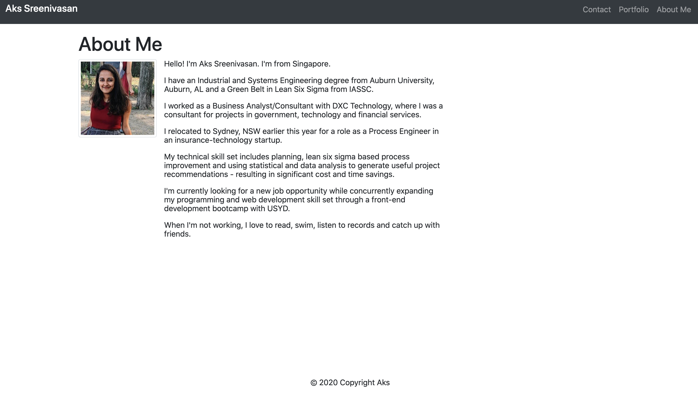
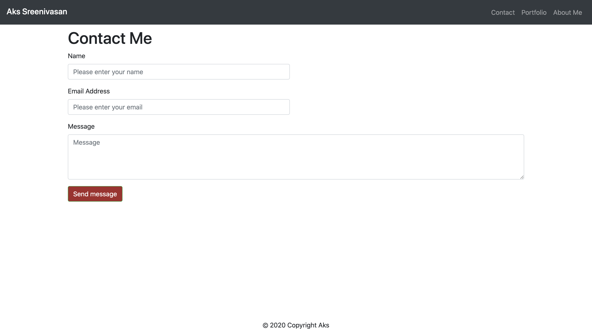

# A Responsive Portfolio

## Description 
What? A project that launches a personal responsive portfolio. 
Why? To serve as a personal website/portfolio.
How? By ensuring that the website design is responsive and has sufficient information provided.

## Link to Deployed Application

https://aksco.github.io/responsiveportfolio/

## Usage

Run the index file ensuring that it opens in Google Chrome.

## Credits/Collaboration

The code was built upon the starter code provided by Bryan Wu from Triology Education Services

## Copyright

© 2020 Trilogy Education Services, LLC, a 2U, Inc. brand. Confidential and Proprietary. All Rights Reserved.
