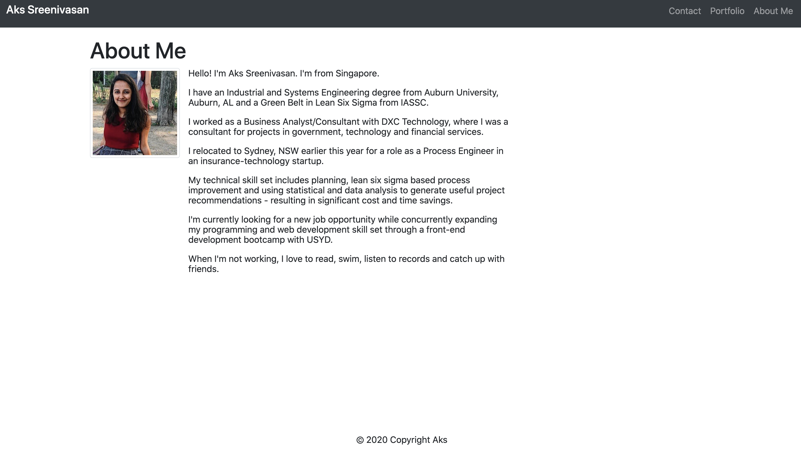
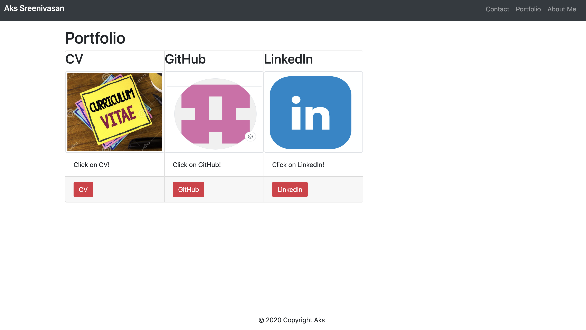

Homework 2

Title

A Responsive Portfolio

Description

What? A project that launches a personal responsive portfolio. 
Why? To serve as a personal website/portfolio.
How? By ensuring that the website design is responsive and has sufficient information provided.

Screenshots

Link to Deployed Application

https://aksco.github.io/responsiveportfolio/

Usage

Run the index file ensuring that it opens in a web browser (Preferably: Google Chrome) 

Credits

© 2020 Trilogy Education Services, LLC, a 2U, Inc. brand. Confidential and Proprietary. All Rights Reserved.
